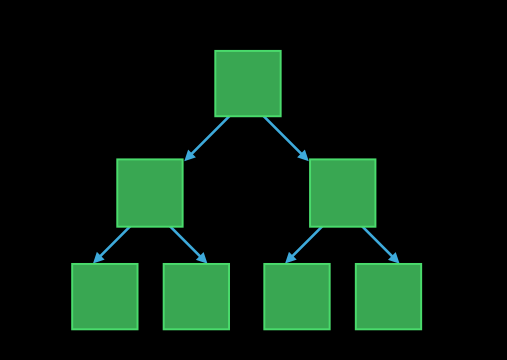
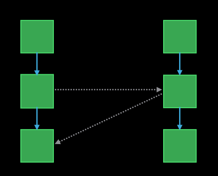
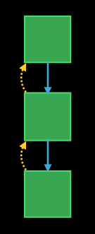

# Memory Management

# 3 types of ownership
```swft
// Strong reference by default
class BowlingPin {}
func juggle(count: Int) {
    var left = BowlingPin()
    if count > 1 {
        var right = BowlingPin()
    }
}

// Weak reference for cross-references
class Apartment {
    weak var tenant: Person?
}

class Person {
    weak var home: Apartment?
    func moveIn(apt: Apartment) {
        self.home = apt
        apt.tenant = self
    }
}
// Weak references are optional values
// Binding the optional produces a strong reference
if let tenant = apt.tenant {
    tenant.buzzIn()
}
apt.tenant?.buzzIn()

// Testing a weak reference alone does not produce a strong reference Chaining doesn't preserve a strong reference between method invocations
if apt.tenant { // does not create strong reference
    apt.tenant!.cashRentCheck()
    apt.tenant!.greet()
}
apt.tenant?.cashRentCheck()
apt.tenant?.greet() // tenant can be deallocated
```

// Unowned for back-references
Although I do not have an owning stake in this object, my life depends on it

```swift
// Can be used like strong references
let holder = card.holder
card.holder.charge(2.19)
```

## Summary
- Use strong references from owners to objects they own
    

- Use weak references among objects with independent lifetimes
    

- Use unowned references from owned objects with the same lifetime
    